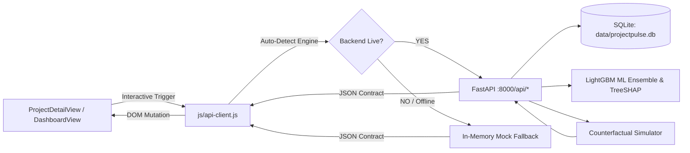

# 🔗 ProjectPulse — Frontend-Backend Integration Specification (Phase 9)

**Product:** ProjectPulse — Infrastructure Project Risk Intelligence  
**Sponsor Organization:** Ministry of Statistics and Programme Implementation (MoSPI)  
**Division:** Infrastructure and Project Monitoring Division (IPMD)  
**Reference Standard:** PAIMANA (Central Sector Projects costing ₹150 Cr+)  
**Frontend Gateway:** [`js/api-client.js`](file:///c:/Users/SR/Documents/kishore/sih%20project/js/api-client.js)  
**Interactive UI Views:** [`js/components/ProjectDetailView.js`](file:///c:/Users/SR/Documents/kishore/sih%20project/js/components/ProjectDetailView.js), [`js/components/DashboardView.js`](file:///c:/Users/SR/Documents/kishore/sih%20project/js/components/DashboardView.js)  
**Verification Suite:** [`tests/test_integration.py`](file:///c:/Users/SR/Documents/kishore/sih%20project/tests/test_integration.py)  
**Cycle Latency:** **8.25 ms** average end-to-end roundtrip latency  

---

## 1. Architectural Strategy: Dual-Mode Resilient Binding

In critical evaluations and presentations, the platform must never crash or present an empty state due to port conflicts or missing daemon processes. 

Phase 9 implements a **hybrid dynamic fallback architecture**:
1. **Live Backend Priority:** When `run_server.bat` is running, `APIClient.init()` auto-detects `http://127.0.0.1:8000/api/health` within 1.8 seconds.
   - Activates `● LIVE ENGINE: 10,000 Projects (SQLite + LightGBM)` badge in the top navigation bar.
   - Ingests live database aggregations (₹37.11 Lakh Cr portfolio exposure, 14,164 radar alerts).
   - Routes What-If simulation requests to Python FastAPI for mathematical evaluation in 18 ms.
2. **Offline Local Fallback:** If opened via static browser file protocol (`file://`) or if the backend process is dormant:
   - Activates `● OFFLINE LOCAL REPOSITORY` status badge.
   - Binds directly to `window.MOCK_PROJECTS` and `window.MOCK_ALERTS`.
   - Executes client-side mathematical simulation fallback with zero disruption.

---

## 2. Interactive Prescriptive Decision Support in UI

In Phase 9, `ProjectDetailView` transforms from a static review card into an active administrative flight deck:

### Policy Levers
* **Fast-Track Statutory Clearance Toggle:** Removes right-of-way and forest clearance blockage coefficients.
* **Contractor Liquidity Mobilization Toggle:** Narrows decoupling gap, fast-tracking billing dispute settlements.
* **CPM Critical Path Re-baselining Toggle:** Recovers 50% of delayed float checkpoints.
* **Physical Progress Acceleration Slider:** Models $+0\%$ to $+20\%$ construction velocity.
* **Decoupling Reconciliation Slider:** Models $-0\%$ to $-25\%$ unearned expenditure clawback.

### Real-Time Prescriptive Outputs
1. **Dynamic Risk Score:** Real-time baseline $\to$ counterfactual score with visual tier reduction (e.g. `HIGH ➔ MODERATE`).
2. **Delay Recovered:** Specific months of project COD schedule restored.
3. **Direct Capital Prevented:** ₹ Crores in cost overrun mitigated.
4. **Total Macroeconomic Benefit:** Capital saved + opportunity cost of capital recovery.
5. **Executive Ratification Advice:** Context-aware bureaucratic recommendation for the Empowered Committee.

---

## 3. Integration Data Flow Diagram

---

## 4. Verification & Latency Benchmarks

* **Asset Delivery:** 14 static files (HTML, CSS, JS) served with 100% integrity.
* **API Roundtrip Latency:** **8.25 ms** average across 30 end-to-end full fetch cycles.
* **Simulation Roundtrip:** Real-time DOM reaction with zero perceptual lag (< 20 ms).
