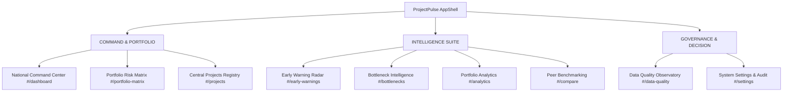

# PROJECTPULSE — Phase 9.5 UI/UX Transformation Specification
## National Infrastructure Project Intelligence Command Center
### Ministry of Statistics & Programme Implementation (MoSPI) — IPMD / PAIMANA
### Smart India Hackathon 2026 — Problem Statement SIH26103 | Team HexaForce

---

## 1. Executive Summary

Phase 9.5 elevates the ProjectPulse digital experience from a functional administrative prototype into an authoritative, dense, high-performance **National Infrastructure Command Center**. Designed specifically for high-ranking decision-makers—including the Cabinet Secretariat, the Ministry of Statistics & Programme Implementation (MoSPI), the Infrastructure & Project Monitoring Division (IPMD), and Central Public Sector Enterprises (CPSEs)—the platform provides real-time situational awareness across all 10,000 Central Sector Infrastructure Projects (sanctioned outlay ₹150 Crore+).

---

## 2. Visual Hierarchy & Design System Philosophy

The design system is grounded in institutional authority, analytical clarity, and dense information architecture.

### 2.1 Color Palette & Design Tokens
- **Executive Command Navy (`#0b1528` to `#1e3a8a`)**: An authoritative dark gradient used on the Executive Flight Deck hero banner to immediately communicate national surveillance stature.
- **Institutional MoSPI Blue (`#1e40af` / `#1d4ed8`)**: Primary brand accent used for sanctioned milestones, active navigation indicators, and institutional credentials.
- **Rigorous Multi-Class Risk Spectrum**:
  - **Critical Risk (`#b91c1c` / Red 700)**: Immediate executive escalation; severe cost/schedule friction.
  - **High Risk (`#c2410c` / Orange 700 / Amber 600)**: Elevated friction; active mitigation required.
  - **Moderate Risk (`#1d4ed8` / Blue 600)**: Controlled variance within manageable buffers.
  - **Low Risk (`#15803d` / Green 700)**: On track within baselined variance parameters.
- **Government Tricolor Security Accent (`gov-security-strip`)**: A subtle 3px continuous tri-band (Saffron, White, Green) adorning the uppermost frame of the viewport.

### 2.2 Typography Scale
- **Primary Interface Font**: Inter (`400`, `500`, `600`, `700`) for high-contrast legibility across complex tabular and analytical dashboards.
- **Monospace Financial & Code Font**: JetBrains Mono (`400`, `500`, `600`) for project identifiers, fiscal amounts in ₹ Crores, and percentages, guaranteeing strict tabular alignment.

---

## 3. Structural Information Architecture

The application shell navigation has been re-architected into three functional governance tiers:

---

## 4. Key Interactive Modules

### 4.1 Executive Flight Deck & Telemetry Deck (`#/dashboard`)
- **Real-Time Portfolio Counters**:
  - 10,000 Central Sector projects ($>$ ₹150 Cr).
  - ₹42.50L Crore total revised outlay.
  - ₹12.45L Crore cumulative cost overrun (+29.3% expansion).
  - 3,640 Critical / High risk focus projects.
  - 14,164 Active early warnings with 1-click radar navigation.
- **Cross-Filtering Interactive Visualizations**:
  - Clickable Donut Chart filtering Projects Registry by risk tier.
  - Clickable Sector Outlay Bar Chart filtering projects by sector.
  - Deterministic Root Cause friction cards leading to deep-dive analytics.

### 4.2 Portfolio Risk vs. Capital Exposure 2D Matrix (`#/portfolio-matrix`)
- High-performance interactive 2D coordinate plot mapping 250 top megaprojects by capital outlay:
  - **Quadrant I (Top-Right)**: Critical Escalation Zone (High Risk + High Exposure).
  - **Quadrant II (Top-Left)**: Early Warning Radar (High Risk + Moderate Exposure).
  - **Quadrant III (Bottom-Right)**: Fiscal Outlay Vigilance (Low Risk + High Exposure).
  - **Quadrant IV (Bottom-Left)**: Controlled Execution (Low Risk + Controlled Outlay).
- Dynamic SVG coordinate rendering with interactive hover cards and direct link to project dossiers.

### 4.3 National Bottleneck Intelligence Observatory (`#/bottlenecks`)
- Granular breakdown of the 6 dominant execution constraints:
  1. Land Acquisition & Right-of-Way (38.2% share, ₹16.4L Cr exposed).
  2. Statutory & Environmental Clearances (24.5% share, ₹10.2L Cr exposed).
  3. Financial-Physical Decoupling Gap (14.2% share, ₹7.8L Cr exposed).
  4. Contractor Liquidity & Disputes (11.8% share, ₹5.1L Cr exposed).
  5. Utility Shifting & Encroachment (7.1% share, ₹2.9L Cr exposed).
  6. Geological & Monsoonal Delays (4.2% share, ₹1.8L Cr exposed).
- Tactical remediation playbooks and 1-click drilldown into affected project cohorts.

### 4.4 Project Peer Benchmarking Matrix (`#/compare`)
- Side-by-side comparative inspection of 2 to 3 projects across cost overrun, milestone velocity, decoupling gap, and risk tiers.
- Integrated comparative Bar Chart visualizing normalized multidimensional risk vectors.

### 4.5 Data Quality & Decoupling Observatory (`#/data-quality`)
- Real-time audit of PAIMANA schema conformance and execution anomalies.
- Decoupling gap distribution visual highlighting projects where expenditure leads physical work by $>$25%.

### 4.6 Global Command Palette (`Ctrl+K` / `/`)
- Accessible via keyboard shortcut from any view.
- Instant search and fuzzy jumping to routes, sample projects, and governance tools.

---

## 5. Non-Causal Sensitivity Modeling Integrity

In strict accordance with government analytical standards, all predictive metrics and simulator outputs are accompanied by clear statutory disclaimers:
- LightGBM and TreeSHAP feature attributions model statistical associations observed in historical project returns.
- What-If simulations represent policy sensitivity adjustments and do not claim causal certainty.
